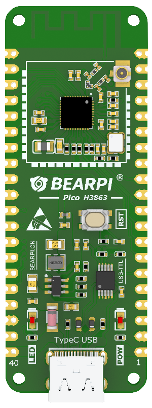
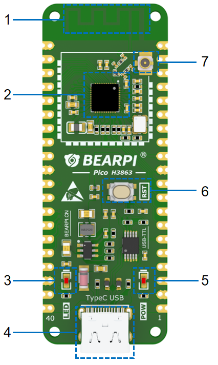

# BearPi-Pico H3863 SDK

BearPi-Pico H3863 SDK 是基于华为海思 Hi3863 芯片的嵌入式开发软件包，为 BearPi-Pico H3863 开发板提供完整的软件开发支持。该 SDK 集成了 Wi-Fi 6、BLE（低功耗蓝牙）和 SLE（星闪低功耗）等多种无线通信协议，适用于物联网设备开发。

## 产品概述



BearPi-Pico H3863 是一款基于高度集成 2.4GHz Wi-Fi6、BLE、SLE 为主控芯片的核心板，具有灵活的数字接口，集成高性能 32bit 微处理器（MCU），硬件安全引擎以及丰富的外设接口，外设接口包括 SPI、UART、I2C、PWM、GPIO，支持 6 路 13bit 分辨率 ADC，内置 SRAM 和合封 Flash，并支持在 Flash 上运行程序。

- 目标用户群体：企业开发者
- 购买链接：[点击进入](https://item.taobao.com/item.htm?id=821386760379)
- 开发教程：[点击进入](https://www.bearpi.cn/core_board/bearpi/pico/h3863/)

## 规格参数

<table>
<thead align="left">
<tr>
<th>规格类型</th>
<th>规格清单</th>
</tr>
</thead>
<tbody>
<tr>
<td>通用规格</td>
<td>
<ul>
<li>CPU：Hi3863 RISC-V 高性能 32bit CPU，最大主频支持 240MHz</li>
<li>存储：SRAM 606KB、ROM 300KB，4MB Flash</li>
<li>主板供电：通过USB 5V供电或者外部 5V供电</li>
<li>LED灯：
<ul>
<li>上电指示 LED，红色</li>
<li>用户定义LED，蓝色</li>
</ul>
</li>
<li>通信：Wi-Fi、SLE、BLE</li>
</ul>
</td>
</tr>
<tr>
<td>电源特性</td>
<td>
<ul>
<li>Typec USB接口，5V供电</li>
<li>内部有5V转3.3V的DCDC</li>
<li>MCU供电电压为3.3V，系统IO电压也为3.3V</li>
</ul>
</td>
</tr>
<tr>
<td>外围接口</td>
<td>
<ul>
<li>I2C*2</li>
<li>SPI*1</li>
<li>QSPI*1</li>
<li>ADC*6</li>
<li>UART*3</li>
<li>PWM*8</li>
<li>GPIO*17</li>
<li>I2S*1</li>
<li>注：上述接口通过复用实现</li>
</ul>
</td>
</tr>
<tr>
<td>其他信息</td>
<td>
<ul>
<li>工作温度：-40℃ ～+85℃</li>
</ul>
</td>
</tr>
</tbody>
</table>

## 产品特点

- 板载基本电路，包括晶振电路，烧录接口等。
- RISC-V 高性能 32bit CPU，最大主频支持 240MHz，支持浮点，支持 SWD。
- 内置 606KB的SRAM、300KB的ROM 和4MB的Flash。
- 支持Wi-Fi 20MHz频宽，提供最大114.7Mbps物理层速率，支持更大的发射功率和更远的覆盖距离，集成IEEE 802.11 b/g/n/ax基带。
- 支持BLE 1MHz/2MHz频宽、BLE4.0/4.1/4.2/5.0/5.1/5.2协议、BLE Mesh和BLE网关功能，最大空口速率2Mbps。
- 支持星闪SLE 1MHz/2MHz/4MHz频宽、SLE1.0协议、支持SLE网关功能，最大空口速率12Mbps。
- 支持加密：AES（Advanced Encryption Standard）、SM2、SM3、SM4 和 TRNG（True Random Number Generator）
- 支持丰富的对外接口
  - 支持 2×I2C（The Inter-Integrated Circuit），可配置为 Master。
  - 支持 1 路 2 通道 I2S（Integrated Interchip Sound）。
  - 支持 2×SPI（Serial Peripheral Interface），支持 master 和 slave 模式可配。
  - 支持 3×UART（Universal Asynchronous Receiver-Transmitter ），最大速率 4Mbit/s，其中 2 个 4 线 UART。
  - 支持 8×PWM（Pulse Width Modulation）。
  - 支持 17 个 GPIO（General-Purpose Input/Output）。

## 核心技术

本项目依托**星闪（NearLink）技术**，实现多机集群协同，降低数据传输延迟。

### 星闪技术优势

- **超低延迟**：星闪SLE协议支持1MHz/2MHz/4MHz频宽，最大空口速率12Mbps，相比传统蓝牙技术，传输延迟显著降低
- **高可靠性**：支持多种频宽配置，适应不同应用场景的通信需求
- **低功耗**：专为物联网设备设计，在保证性能的同时实现超低功耗运行
- **多模并发**：支持Wi-Fi、BLE、SLE多协议并发工作，灵活适配不同通信场景

### 多机集群协同

基于星闪技术，本项目支持：

- **设备间快速组网**：多台BearPi-Pico H3863开发板可通过SLE协议快速建立连接
- **实时数据同步**：低延迟特性确保多设备间数据实时同步
- **分布式处理**：支持任务分发和协同计算，提升系统整体性能
- **网关功能**：支持SLE网关模式，实现不同协议设备间的互联互通

### 应用场景

- **工业物联网**：多传感器节点协同采集数据，实时传输至网关
- **智能家居**：多设备间快速响应，实现智能场景联动
- **无人机集群**：多无人机协同作业，实时通信控制
- **工业自动化**：设备间低延迟通信，提升自动化控制精度

## 功能接口



| 编号 | 功能 | 说明 |
| :--- | :--- | :--- |
| 1 | 2.4G 天线 | Wi-Fi、BLE 和 SLE 天线 |
| 2 | 主控芯片 Hi3863 | RISC-V 高性能 32bit CPU，最大主频支持 240MHz，合封4MB Flash，支持WiFi、SLE、BLE多模并发 |
| 3 | 用户灯 | 蓝色 LED灯，用户可通过代码自定义控制 |
| 4 | USB Type-C | 支持 5V USB 输入，具备调试烧录功能 |
| 5 | 电源灯 | 红色电源灯，正常工作时常亮 |
| 6 | Reset Key | 复位按键，可通过该按键复位开发板 |
| 7 | IPX 天线座 | IPX 天线座 可用于外接天线，使用前需要调整天线电阻 |

## 项目结构

```
bearpi-pico_h3863-master/
├── application/          # 应用程序代码
│   ├── samples/          # 示例代码
│   │   ├── peripheral/   # 外设示例
│   │   │   ├── adc/      # ADC示例
│   │   │   ├── blinky/   # LED闪烁示例
│   │   │   ├── button/   # 按键示例
│   │   │   ├── i2c/      # I2C示例
│   │   │   ├── led/      # LED控制示例
│   │   │   ├── pinctrl/  # 引脚控制示例
│   │   │   ├── pwm/      # PWM示例
│   │   │   ├── spi/      # SPI示例
│   │   │   ├── systick/  # 系统滴答定时器示例
│   │   │   ├── tasks/    # 任务管理示例
│   │   │   ├── tcxo/     # 温补晶振示例
│   │   │   ├── timer/    # 定时器示例
│   │   │   ├── uart/     # UART示例
│   │   │   └── watchdog/ # 看门狗示例
│   │   ├── products/     # 产品示例
│   │   │   ├── ble_uart/       # BLE串口通信示例
│   │   │   ├── sle_uart/       # SLE串口通信示例
│   │   │   ├── sle_uart_1_vs_8/# SLE一对多通信示例
│   │   │   └── sle_gateway/    # SLE网关示例
│   │   └── wifi/         # Wi-Fi示例
│   │       ├── softap_sample/  # 软AP示例
│   │       ├── sta_sample/     # STA模式示例
│   │       └── udp_client/     # UDP客户端示例
│   └── ws63/             # WS63平台特定代码
├── bootloader/           # 引导加载程序
├── build/                # 构建配置和脚本
├── cmake-build-debug/    # CMake构建目录
├── docs/                 # 文档和图片资源
├── drivers/              # 设备驱动
├── include/              # 头文件
├── kernel/               # 内核代码
├── libs_url/             # 库文件URL配置
├── middleware/            # 中间件
├── open_source/          # 开源组件
├── output/               # 构建输出
├── protocol/             # 协议栈
├── tools/                # 工具脚本
├── CMakeLists.txt        # CMake主配置文件
├── build.py              # 构建脚本
├── config.in             # 配置文件
├── Dockerfile            # Docker配置
└── requirements.txt      # Python依赖
```

## 快速开始

### 环境准备

1. **安装必要的工具链**
   - CMake 3.14.1 或更高版本
   - Python 3.x
   - RISC-V 工具链

2. **获取代码**
   ```bash
   git clone https://github.com/openharmony/bearpi-pico_h3863.git
   cd bearpi-pico_h3863
   
   # 或者从华为云获取
   # git clone https://gitee.com/openharmony/bearpi-pico_h3863.git
   ```

3. **安装Python依赖**
   ```bash
   pip install -r requirements.txt
   ```

### 构建项目

1. **配置项目**
   ```bash
   # 使用menuconfig进行配置
   make menuconfig
   ```

2. **构建SDK**
   ```bash
   # 清理并重新构建
   python build.py -c
   
   # 使用多线程构建（例如8线程）
   python build.py -j8
   
   # 构建release版本
   python build.py -release
   ```

3. **构建应用程序**
   ```bash
   # 进入示例目录
   cd application/samples/products/sle_uart
   
   # 构建示例
   python build.py
   ```

### 烧录和调试

1. **连接开发板**
   - 使用USB Type-C线连接开发板到电脑
   - 确保安装了必要的驱动程序

2. **烧录固件**
   - 使用华为海思提供的烧录工具
   - 选择对应的固件文件进行烧录

3. **调试**
   - 支持SWD调试接口
   - 可使用J-Link或DAP-Link等调试器

## 示例项目

SDK提供了多个示例项目，帮助开发者快速上手：

### 外设示例 (`application/samples/peripheral/`)
- **adc/**: ADC采样示例
- **blinky/**: LED闪烁示例
- **button/**: 按键检测示例
- **i2c/**: I2C通信示例
- **led/**: LED控制示例
- **pinctrl/**: 引脚控制示例
- **pwm/**: PWM输出示例
- **spi/**: SPI通信示例
- **systick/**: 系统滴答定时器示例
- **tasks/**: 任务管理示例
- **tcxo/**: 温补晶振示例
- **timer/**: 定时器示例
- **uart/**: UART串口通信示例
- **watchdog/**: 看门狗示例

### 产品示例 (`application/samples/products/`)
- **ble_uart**: BLE串口通信示例
- **sle_uart**: SLE串口通信示例
- **sle_uart_1_vs_8**: SLE一对多通信示例
- **sle_gateway**: SLE网关示例

### Wi-Fi示例 (`application/samples/wifi/`)
- **softap_sample/**: 软AP模式示例
- **sta_sample/**: STA模式示例
- **udp_client/**: UDP客户端示例

## 文档资源

- [开发教程](https://www.bearpi.cn/core_board/bearpi/pico/h3863/)
- [Hi3863芯片规格书](https://www.hisilicon.com/)
- [BearPi开发板文档](https://www.bearpi.cn/)

## 常见问题

### Q: 如何选择通信协议？
A: 
- **Wi-Fi**: 适用于需要高带宽、远距离传输的场景
- **BLE**: 适用于低功耗、短距离通信的场景
- **SLE**: 适用于高速率、低延迟的星闪通信场景

### Q: 支持哪些操作系统？
A: SDK基于华为LiteOS操作系统，提供完整的OS支持。

### Q: 如何获取技术支持？
A: 
- 访问[华为开发者论坛](https://developer.huawei.com/)
- 联系BearPi技术支持团队

## 许可证

本项目采用 Apache License 2.0 许可证。详情请参阅 [LICENSE](LICENSE) 文件。

## 相关链接

- [华为海思官网](https://www.hisilicon.com/)
- [BearPi官网](https://www.bearpi.cn/)
- [华为开发者联盟](https://developer.huawei.com/)

---

**注意**: 本SDK可能包含受出口管制的加密软件，请确保遵守相关法律法规。